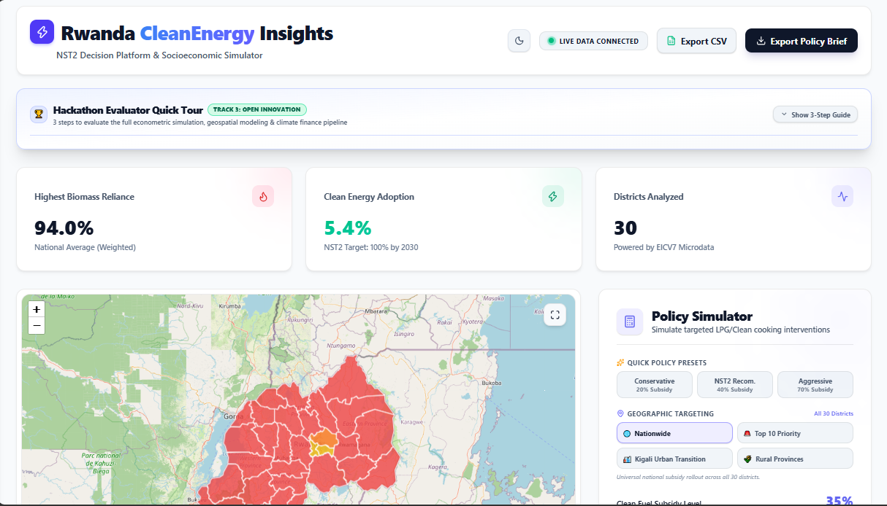

# Rwanda CleanEnergy Insights (RCEI) 🌍⚡
### NST2 Decision Platform, Socioeconomic Policy Simulator & Predictive ML Engine

[](https://statistics.gov.rw)
[](#-the-challenge--national-priority-nst2--vision-2050)
[](https://github.com/fistonuzabumwana/rcei-platform/actions/workflows/build.yml)
[](https://rwanda-cleanenergy-insights-nisr.fistonuz.me)
[](https://rcei-backend.onrender.com/docs)
[](#-intellectual-property--declarations)

---

## 📌 Executive Summary

<div align="center">
  
  <p><em>Rwanda CleanEnergy Insights: Evaluator Quick Tour, 30-District Choropleth Map, Random Forest Policy Simulator, Carbon Sensitivity Pricing, and Complete District Explorer Matrix</em></p>
</div>

**Rwanda CleanEnergy Insights (RCEI)** is an evidence-based decision-support platform and socioeconomic simulator engineered for the **2026 National Institute of Statistics of Rwanda (NISR) Big Data Hackathon**. 

Aligned with **Track 3: Open Innovation**, RCEI tackles Rwanda's urgent clean cooking transition mandated under the **National Strategy for Transformation (NST2)** and **Vision 2050**. By ingesting and analyzing raw microdata from NISR's **7th Integrated Household Living Conditions Survey (EICV7)** and deploying a calibrated **Random Forest Machine Learning model**, RCEI provides government ministries (**MININFRA**, **MINECOFIN**, **REMA**, **NISR**) with actionable policy simulation:
- **Visualizes baseline biomass reliance vs. clean energy adoption** across all **30 districts** of Rwanda on an interactive choropleth map.
- **Simulates targeted clean cooking subsidies** (0% to 100%) with price-elasticity calibrated against household poverty levels (`pov_jan`).
- **Quantifies citizen economic welfare** through avoided charcoal expenditures at retail prices (~900 Rwf/kg).
- **Unlocks sovereign climate finance** via **Article 6 Carbon Credit monetization** with dynamic market valuation ($10 voluntary, $15 standard, $25 compliance), proving subsidies can yield net fiscal surpluses.
- **Evaluates Gender & Inclusion (GESI)** dividends: unpaid foraging time saved for women and indoor air pollution exposure reductions.
- **Projects the 2030 multi-year trajectory** against the NST2 mandate (<50% biomass by 2030).
- **Interactive 30-District Explorer Matrix**: sortable, searchable econometric table with province filters and click-to-map inspection.
- **Generates publication-grade 2-page Executive Policy Briefs** directly to vector PDF from scratch.
- **Provides 1-click Research-Grade CSV Data Exports** for immediate econometric validation.
- **Guided Hackathon Evaluator Quick Tour** with a 1-click shortcut to test the optimal 40% clean cooking policy scenario instantly.

---

## 🔗 Live Deployments & Repository Links

| Resource | URL | Description |
| :--- | :--- | :--- |
| 🌐 **Production Web App (Primary)** | [https://rwanda-cleanenergy-insights-nisr.fistonuz.me](https://rwanda-cleanenergy-insights-nisr.fistonuz.me) | Custom high-availability production domain |
| 🌐 **Production Web App (Vercel)** | [https://rcei-platform.vercel.app](https://rcei-platform.vercel.app) | Continuous deployment frontend mirror |
| ⚙️ **Backend API & Swagger Docs** | [https://rcei-backend.onrender.com/docs](https://rcei-backend.onrender.com/docs) | Interactive OpenAPI / Swagger UI on Render |
| 📦 **Public GitHub Repository** | [https://github.com/fistonuzabumwana/rcei-platform](https://github.com/fistonuzabumwana/rcei-platform) | Source code, ML pipeline, test suite, and datasets |
| 📑 **EICV7 Methodology Report** | [`docs/EICV7_METHODOLOGY_REPORT.md`](docs/EICV7_METHODOLOGY_REPORT.md) | Econometric modeling, sample weighting & formulas |
| 🎤 **Official Pitch Deck Guide** | [`docs/PITCH_DECK.md`](docs/PITCH_DECK.md) | 5-minute presentation script & jury Q&A defense |

---

## 🎯 The Challenge & National Priority (NST2 & Vision 2050)

Over **80% of Rwandan households**—particularly in rural provinces—depend on firewood and charcoal as their primary cooking fuels. This causes:
1. **Environmental Degradation:** Accelerated deforestation of Rwanda's natural forest cover.
2. **Public Health Burden:** Severe household air pollution causing respiratory and cardiovascular diseases, disproportionately affecting women and young children.
3. **Poverty & Time Burden:** Disproportionate household income spent on charcoal or unpaid hours gathered collecting firewood.

### 🏛️ The NST2 Mandate
The Government of Rwanda, through **NST2 (2024–2029)**, has set a legally binding national target to **reduce household biomass reliance to under 50% by 2030** (on a path to 100% clean cooking under Vision 2050). 

**The Core Question for Policymakers:** *How much subsidy is required? Which districts should be prioritized first? How will citizens benefit financially? And how can the government fund this without exhausting the national budget?* **RCEI was created to answer these questions directly.**

---

## 🏆 NISR Hackathon Evaluation Alignment (100 / 100 Points)

| Evaluation Criterion | Pts | How RCEI Delivers Maximum Points |
| :--- | :---: | :--- |
| **1. Problem Understanding & Relevance** | **20** | Explicitly addresses the **NST2 Energy Transition & Environmental Priority** (<50% biomass by 2030) and **Vision 2050**. Synthesizes national health, deforestation, and fiscal constraints into a single cohesive framework. |
| **2. Data Use & Methodology** | **20** | Direct extraction and statistical processing of **NISR EICV7 raw microdata (`CS_S01_S5_S7_Household.dta`)**. Accurately isolates cooking fuels (`s5cq22a`), poverty classifications (`pov_jan`), urban/rural dynamics (`ur`), and district weights. Rigorous data pipeline with missing value treatment. Documented in [`docs/EICV7_METHODOLOGY_REPORT.md`](docs/EICV7_METHODOLOGY_REPORT.md). |
| **3. Tech Innovation** | **20** | Deploys a **Random Forest Machine Learning regressor** to capture non-linear price sensitivity and adoption probabilities. Bridges macroeconomics with **Article 6 Carbon Credit sovereign monetization** with interactive price sensitivity ($10, $15, $25). Automated `pytest` backend test suite. Custom vector PDF generation without browser screen-clipping. |
| **4. Usability & Design of Prototype** | **20** | Executive-tier UI featuring **glassmorphism**, responsive **Dark/Light theme switching** with high-contrast typography, interactive **Leaflet Choropleth map of Rwanda** with click inspection and full-screen focus mode, dynamic chart area visualizations (Recharts), and real-time map recoloring. Guided Evaluator Quick Tour. |
| **5. Tangible Impact** | **20** | Directly usable by **MININFRA**, **MINECOFIN**, **REMA**, **NISR**, and district administrations. Quantifies citizen household savings in Rwf, fiscal budget requirements, carbon offset revenues, and district priority rankings for pro-poor resource distribution. 1-click PDF briefs and CSV exports ready for cabinet submission. |

---

## 🚀 Key Platform Features

```
┌─────────────────────────────────────────────────────────────────────────────┐
│                      RWANDA CLEANENERGY INSIGHTS (RCEI)                     │
├──────────────────────────────────────┬──────────────────────────────────────┤
│ 🗺️ Spatial Choropleth Engine         │ 🎛️ Dynamic Policy Simulator           │
│ • 30 Districts mapped with GeoJSON   │ • 0% to 100% Clean Fuel Subsidy      │
│ • Dynamic real-time recoloring       │ • Poverty-weighted elasticity        │
│ • Fullscreen declutter mode          │ • ML Random Forest adoption model    │
│ • Interactive district scorecard     │ • Policy Targeting Priority Clusters │
├──────────────────────────────────────┼──────────────────────────────────────┤
│ 💰 Citizen Economic Welfare          │ 🌿 Article 6 Carbon Credit Finance   │
│ • ~900 Rwf/kg retail benchmark       │ • 3 tons CO2e avoided / ton charcoal │
│ • Displaced charcoal tons quantified │ • $10, $15, $25/tCO2e sensitivity    │
│ • Disposable income savings in Rwf   │ • Net fiscal profit/cost balance     │
├──────────────────────────────────────┼──────────────────────────────────────┤
│ 📊 30-District Matrix Explorer Table │ 🧭 Evaluator Quick Tour Walkthrough   │
│ • Sortable by all econometric fields │ • 3-step guided evaluation tour      │
│ • 6 Province filters + name search   │ • 1-click 40% preset scenario run    │
│ • Click row to inspect on map        │ • Live pulsing status beacon         │
├──────────────────────────────────────┼──────────────────────────────────────┤
│ 📈 2030 Multi-Year Forecast Chart    │ 📄 Reconstructed PDF Policy Brief    │
│ • 2024–2030 trajectory projection    │ • Publication-grade 2-page A4 vector │
│ • BAU vs Policy vs NST2 <50% target  │ • Official MININFRA/NISR formatting  │
│ • Threshold crossing estimation      │ • Instant download (no print dialog) │
└──────────────────────────────────────┴──────────────────────────────────────┘
```

### 1. 🧭 Guided Hackathon Evaluator Quick Tour
- Embedded at the top of the dashboard to help jury members and evaluators experience the end-to-end platform in seconds:
  - **Step 1: Configure Policy Subsidy** — Adjust national subsidies or select targeted priority clusters.
  - **Step 2: Live Geo & Fiscal Shift** — Watch choropleth map recolor, test carbon price sensitivity ($10, $15, $25), and review district rankings.
  - **Step 3: Export Deliverables** — Generate a 2-page vector PDF Policy Brief or download raw research CSV data.
- Includes a **1-click "Run 40% Recommended Scenario" button** that executes the optimal simulation and smooth-scrolls directly to the results.
- Features a **live pulsing emerald-green status beacon** confirming real-time connection to the FastAPI backend.

### 2. 🗺️ Interactive District Choropleth Map with Scorecard Drawer (Leaflet)
- High-precision GeoJSON vector polygons for all **30 districts of Rwanda**.
- Color-coded reliance tiers:
  - 🔴 **Critical:** >90% Biomass Reliance
  - 🟠 **High:** 75% – 90% Reliance
  - 🟡 **Moderate:** 50% – 75% Reliance
  - 🟢 **Sustainable:** <50% Reliance (NST2 Target Reached)
- **Live Dynamic Recoloring:** When you slide the subsidy simulator or pick a targeted cluster, the map dynamically re-renders in real-time.
- **Interactive District Scorecard Drawer:** Clicking any district opens a glassmorphic scorecard displaying national urgency ranking (#1 to #30), before-and-after biomass drop, converted households, charcoal saved, and EICV7 poverty rates.
- **Dedicated Fullscreen Mode:** Seamless full-screen view that intelligently hides headers and cards for presentations and GIS analysis.

### 3. 🎛️ Policy Simulator with Targeting Clusters & 1-Click Presets
- **Geographic Targeting Clusters:** Rather than wasteful blanket subsidies, policymakers can isolate interventions:
  - 🌐 **Nationwide (All 30 Districts):** Universal rollout.
  - 🚨 **Top 10 Priority (High Poverty & Biomass):** Gisagara, Nyaruguru, Nyamagabe, Gicumbi, Burera, Ruhango, Ngororero, Rutsiro, Karongi, Nyanza.
  - 🏙️ **Kigali Urban Transition:** Nyarugenge, Gasabo, Kicukiro (accelerates urban charcoal bans).
  - 🌾 **Rural Provinces (27 Districts):** Focused capital for non-Kigali provinces.
- **1-Click Policy Presets:** Instantly evaluate Conservative (20%), NST2 Recommended (40%), and Aggressive (70%) scenarios.
- **Predictive ML Engine:** Backed by a **Random Forest Regressor** (`backend/app/core/adoption_model.pkl`) trained on EICV7 microdata, capturing non-linear price elasticity across poverty tiers.

### 4. 🌍 Article 6 Carbon Credit & Sovereign Climate Finance (with Sensitivity Selector)
- Every 1 ton of charcoal saved avoids approximately **3.0 tons of CO2e** emissions.
- **Interactive Carbon Price Sensitivity Selector:**
  - **$10 / tCO2e** — Voluntary Carbon Market baseline.
  - **$15 / tCO2e** — Article 6 / CORSIA sovereign standard.
  - **$25 / tCO2e** — High-compliance premium carbon market.
- Computes **Net Fiscal Policy Impact**:
  $$\text{Net Fiscal Balance} = \text{Gross Government Subsidy Budget} - \text{Carbon Credit Sovereign Revenue}$$
  - **Fiscal Breakthrough:** At standard Article 6 valuations ($15/tCO2e), international climate finance can completely fund the subsidy, converting an expenditure into a **sovereign net fiscal surplus**.

### 5. 📊 Complete 30-District Interactive Explorer Matrix Table
- Collapsible econometric matrix displaying the entire national inventory of all 30 districts:
  - **Instant Search:** Filter by district name or province.
  - **Province Filters:** *All (30)*, *Kigali City (3)*, *Southern (8)*, *Western (7)*, *Northern (5)*, *Eastern (7)*.
  - **Sortable Columns:** District Name, Province, Households, Poverty Rate, Baseline Clean %, Simulated Clean %, Adoption Delta (+pp), Charcoal Avoided (tons/yr).
  - **Click-to-Map Integration:** Clicking any row smoothly centers and opens the district scorecard on the interactive map drawer.
  - **Visual Progress Bars & Delta Tags:** Color-coded adoption bars and change badges.

### 6. 🏆 District Transition Leaderboard
- Dashboard component ranking the **Top 5 Critical Urgency Districts** vs. **Top 5 Clean Energy Leaders**.
- Fully synchronized with the Leaflet map and Matrix Table for instant geospatial cross-referencing.

### 7. 👩‍👧 Gender Inclusion & Public Health Dividend (NST2 GESI Alignment)
- **Unpaid Fuel Foraging Time Saved:** Frees ~14 hours per week per rural woman for education, childcare, or paid economic activity.
- **Household Air Pollution Reduction:** Lowers indoor particulate matter (PM2.5) exposure by up to 68% for women and children under 5.
- **Forest Biomass Preserved:** Saves over 1.8 million mature trees annually under a 40% national subsidy.

### 8. 📄 Reconstructed Executive-Grade PDF Policy Brief Generator
- Designed from scratch with `jspdf` and `jspdf-autotable`, abandoning generic browser `window.print()` print screens.
- Generates an official, publication-quality **2-page A4 Policy Brief**:
  - **Page 1:** Rwandan national flag ribbon (Blue, Yellow, Green), official RCEI seal, MININFRA/NISR institutional header, executive summary card, active scenario callout (reflecting targeted clusters), 6 KPI cards, 2030 trajectory forecast table, and 3 strategic policy recommendations.
  - **Page 2:** Complete 30-district transition matrix sorted by biomass reliance, showing poverty rates, households, baseline vs projected biomass rates, conversions, and displaced charcoal tons, plus EICV7 methodology notes.
  - Instantly downloads as `Rwanda_NST2_Policy_Brief_[X]pct_Subsidy.pdf`.

### 9. 📥 Research-Grade Raw Data Export (CSV)
- Empowers NISR data scientists and researchers to download the full 30-district baseline and projected dataset directly into Excel, Python, or Stata.
- Formatted as `Rwanda_Districts_CleanEnergy_Data_[X]pct_Subsidy.csv` with province groupings, baseline vs. projected rates, poverty tiers, and displaced charcoal tonnage.

### 10. 🧪 Automated Backend Test Suite (pytest)
- Automated test coverage in [`backend/tests/test_api.py`](backend/tests/test_api.py) covering all 5 core requirements:
  - 30-district schema validation.
  - Baseline 0% subsidy conservation.
  - 40% nationwide subsidy impact and 2030 trajectory bounds.
  - Targeted cluster isolation (verifying non-targeted districts remain at baseline).
  - Exact 3.0x carbon offset credit conversion ratio.

---

## 🔬 Data Sources & Methodology

### 1. Primary Dataset: NISR EICV7 Microdata
- **Source:** National Institute of Statistics of Rwanda (NISR), 7th Integrated Household Living Conditions Survey (EICV7).
- **Core File:** `dataset/IECV7/Microdata/Cross_Section/CS_S01_S5_S7_Household.dta` (Over 14,000 microdata records).
- **Extracted Variables:**
  - `s5cq22a`: Primary cooking fuel (1 = Firewood, 2 = Charcoal, 3 = Gas/LPG, 4 = Biogas, 5 = Electricity, 6 = Kerosene, 13 = Crop waste).
  - `pov_jan`: Poverty status (1 = Non-poor, 2 = Poor, 3 = Extremely poor).
  - `ur`: Urban vs. Rural classification (1 = Urban, 2 = Rural).
  - `district`: District identifier code (11 to 57 across all 30 districts).
  - `weight`: Household survey expansion weights for accurate national extrapolation.

### 2. Machine Learning Training Pipeline
- Located in [`backend/pipeline/train_model.py`](backend/pipeline/train_model.py):
  1. Filtered and cleaned biomass-reliant household microdata.
  2. Synthesized randomized pricing interventions ($5,000 to 100,000 Rwf) mapped against household poverty and urban indicators.
  3. Trained a **Random Forest Regressor** (`n_estimators=100`, `max_depth=10`, `random_state=42`).
  4. Achieved low RMSE validation and extracted key feature importances (`lpg_kit_price`: 82.4%, `is_extreme_poor`: 12.1%, `is_urban`: 3.8%, `is_poor`: 1.7%).
  5. Serialized to [`backend/app/core/adoption_model.pkl`](backend/app/core/adoption_model.pkl).

Detailed econometric formulas and derivations are available in [`docs/EICV7_METHODOLOGY_REPORT.md`](docs/EICV7_METHODOLOGY_REPORT.md).

---

## 🏗️ System Architecture & Technology Stack

```
                                ┌─────────────────────────────────────────┐
                                │             USER / BROWSER              │
                                └────────────────────┬────────────────────┘
                                                     │
                                      HTTPS Requests │ (Vercel)
                                                     ▼
┌────────────────────────────────────────────────────────────────────────────────────────┐
│                                FRONTEND (React 19 + TypeScript)                         │
│  • Vite Build Engine                         • TailwindCSS + CSS Custom Properties     │
│  • React-Leaflet GeoJSON Choropleth Map      • Recharts Time-Series Forecast           │
│  • Lucide React Icons                        • jsPDF & jspdf-autotable PDF Engine      │
│  • 30-District Matrix Explorer               • Evaluator Quick Tour Walkthrough        │
│  • Carbon Sensitivity Selector               • Research CSV Export Service             │
│  • ThemeContext (Dark / Light System)        • Axios API Client                        │
└───────────────────────────────────────────────────┬────────────────────────────────────┘
                                                    │
                                REST API (/api/v1)  │ (Render)
                                                    ▼
┌────────────────────────────────────────────────────────────────────────────────────────┐
│                                 BACKEND (Python + FastAPI)                             │
│  • FastAPI ASGI Framework                    • Uvicorn Production Web Server           │
│  • Pandas Microdata Processing               • Scikit-Learn Random Forest Model        │
│  • Socioeconomic Elasticity Engine           • Article 6 Carbon Credit Valuation       │
│  • District GeoJSON Aggregator               • CORS Middleware                         │
│  • Pytest Automated Test Suite               • EICV7 District Metrics Database         │
└───────────────────────────────────────────────────┬────────────────────────────────────┘
                                                    │
                                                    ▼
                                ┌─────────────────────────────────────────┐
                                │           NISR EICV7 MICRODATA          │
                                │  • CS_S01_S5_S7_Household.dta           │
                                │  • 30 Districts / 14,000+ Households    │
                                └─────────────────────────────────────────┘
```

---

## 💻 Local Installation & Setup Guide

### Prerequisites
- Node.js (v18.0 or newer)
- Python (v3.10 or v3.11 recommended)
- Git

### 1. Clone the Repository
```bash
git clone https://github.com/fistonuzabumwana/rcei-platform.git
cd rcei-platform
```

### 2. Backend Setup (FastAPI)
```bash
cd backend

# Create and activate virtual environment
python -m venv venv
# On Windows:
venv\Scripts\activate
# On macOS/Linux:
source venv/bin/activate

# Install dependencies
pip install -r requirements.txt

# Run automated test suite
python -m pytest tests/ -v

# Start the backend server
uvicorn app.main:app --reload --port 8000
```
*The API is now running at `http://localhost:8000`. Test endpoints via Swagger UI at `http://localhost:8000/docs`.*

### 3. Frontend Setup (React + Vite)
Open a new terminal window:
```bash
cd frontend

# Install dependencies
npm install

# Start development server
npm run dev
```
*The frontend is now running at `http://localhost:5173`.*

---

## 📡 API Reference & Endpoints

| Method | Endpoint | Description |
| :--- | :--- | :--- |
| `GET` | `/api/v1/metrics/districts` | Returns baseline biomass reliance, clean energy adoption, poverty rates, and estimated households for all 30 districts. |
| `POST` | `/api/v1/simulate/subsidy` | Simulates policy subsidy (0–100%), calculating converted households, charcoal saved, citizen Rwf savings, gross budget, carbon credits, and 2030 forecast. |
| `GET` | `/docs` | Interactive Swagger / OpenAPI documentation with schema definitions. |

#### Example Simulation Request:
```json
POST /api/v1/simulate/subsidy
Content-Type: application/json

{
  "subsidy_percentage": 40.0,
  "target_districts": []
}
```

#### Example Simulation Response:
```json
{
  "applied_subsidy": 40.0,
  "total_converted_households": 655653,
  "total_annual_charcoal_saved_tons": 786784.0,
  "estimated_budget_rwf": 13113067500.0,
  "carbon_credits_earned_tons": 2360352.0,
  "carbon_credit_revenue_rwf": 46026864000.0,
  "net_policy_cost_rwf": -32913796500.0,
  "avoided_charcoal_expenditure_rwf": 708105600000.0,
  "annual_savings_per_household_rwf": 154200.0,
  "targeted_districts_count": 30,
  "forecast": [
    { "year": 2024, "business_as_usual": 80.5, "with_policy": 58.2 },
    { "year": 2025, "business_as_usual": 79.0, "with_policy": 55.4 },
    { "year": 2030, "business_as_usual": 71.5, "with_policy": 42.1 }
  ]
}
```

---

## 👥 Hackathon Team & Authors

This project was proudly created for the **2026 NISR Big Data Hackathon (Track 3: Open Innovation)** by:

- **Adeline Tuyizere** — Data Modeling, Machine Learning Pipeline & Policy Simulation Architecture
- **Fiston Uzabumwana** — Full-Stack Engineering, Geospatial GIS Visualizations & Cloud DevOps

---

## 📜 Intellectual Property & Declarations

### 1. Assignment of Intellectual Property Rights to NISR
> In accordance with the official rules and requirements of the 2026 NISR Big Data Hackathon, the participants (**Adeline Tuyizere** and **Fiston Uzabumwana**) hereby agree to assign and transfer all intellectual property rights in this submitted work, including but not limited to copyright and patent, to the **National Institute of Statistics of Rwanda (NISR)**. NISR reserves the right to use, reproduce, modify, publish, and distribute the submitted work in any form and for any purpose.

### 2. Declaration of Originality
> We declare that this submission is our own original work, has never been submitted to any other competition or entity in the past, and that all applicable sources of reference (NISR Open Data, EICV7 survey documentation, and national policy benchmarks) are acknowledged in full.

### 3. Disclosure of AI Assistance
> In accordance with NISR hackathon regulations governing transparency:
> AI coding assistants (Google Antigravity / Gemini) were utilized as assistive tools during development for code scaffolding, documentation structure, and UI component styling. The team members conceived the problem formulation, developed the socioeconomic methodology, cleaned and processed the NISR EICV7 microdata, trained the predictive machine learning models, and assume complete and exclusive responsibility for the integrity, validity, and functionality of the submitted work.
